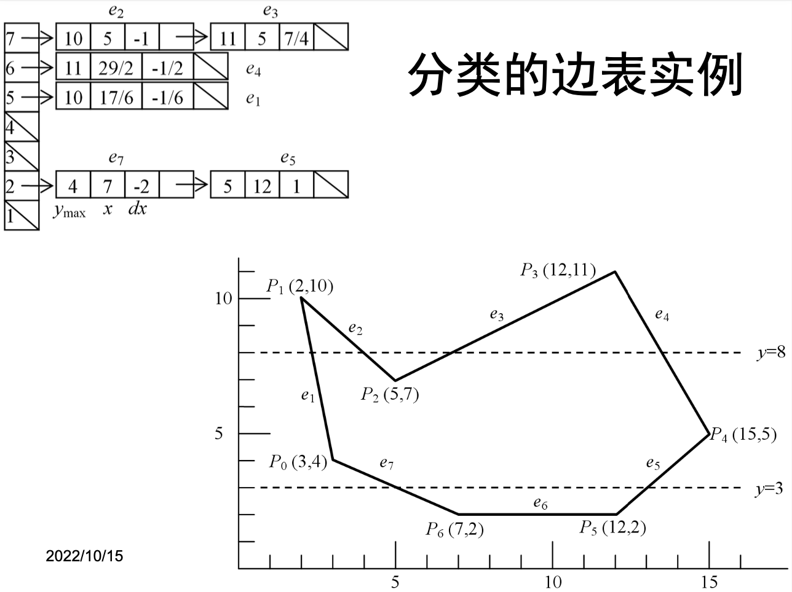

# Z-Buffer实验报告

陆子仪 22221137 计算机科学与技术学院

# 1 概述

# 2 算法介绍

## 2.1 多边形扫描转换（Scan Conversion）

多边形扫描转换是基于扫描线算法对多边形进行转换，即从几何表示转换为光栅（离散）表示。该算法使用到了以下几个数据结构：**分类边表（Sorted Edge Table）**和**活化边链表（Active Edge List）**，下面分别介绍两种数据结构及其作用：

首先对`Edge`的数据结构做简单介绍：

```cpp
struct Edge {
    long y_max; // 最大纵坐标
    float x;    // 边的当前横坐标
    float dx;   // 边的斜率的倒数
};
```

然后是分类边表（Sorted Edge Table）：




分类边表的本质为一个数组，数组的下标对应着纵坐标的值，数组的每一个元素上储存着从该纵坐标出发的所有边（也就是边的纵坐标最小值为数组下标，我们认为所有边都是从纵坐标较小的顶点开始的）。这里要注意处理一个**特殊情况**（如上方右图所示），当点$P_i$两侧的边在扫描线的两边时，需要将这条边“断开”，即将以$P_i$开始的边上移一个像素（截断一个像素）。此外，我们忽略与扫描线平行的边。

接下来是活化边链表（Active Edge List），其本质是一个储存了当前扫描线经过的所有边的链表。


算法从下往上移动扫描线，迭代执行下述步骤：

1. 将分类边表中下标为当前扫描线高度（`y`）的边加入活化边链表
2. 对链表根据`x`值从小到大排序
3. 从左到右，以两条边为一组，填充两条边`x`坐标之间的像素

## 2.2 扫描线Z-Buffer算法（Scanline Z-Buffer）

### 算法概述

与目前更为主流的Z-Buffer不同，扫描线Z-Buffer只对当前的扫描线使用Z-Buffer，因此相对于使用整个帧画幅大小的Z-Buffer而言，扫描线Z-Buffer算法能在更有限的空间限制下运行。该算法基于多边形的扫描转换，同样使用了**分类边表**和**活化边链表**，但是做出了如下改进：

对于每条边，其储存的数据扩展为，主要额外记录了以下几个信息：

- `id`：三角形编号，用于着色
- `z`：当前深度
- `dzdx`：z相对于x的偏导
- `dzdy`：z相对于y的偏导

```cpp
struct Edge {
    float x;
    float dx;
    long  y_max; // max y coordinate
    long  id;    // primitive id (triangle id in case of triangle mesh)
    float z;     // current z value on edge
    float dzdx;  // derivation of z w.r.t. x on the surface
    float dzdy;  // derivation of z w.r.t. y on the surface
};
```

### 平面方程的计算

计算时，首先求出三角形所在平面的方程的参数：$Ax + By + Cz = D$。我们有三角形的三个顶点：$v_0, v_1, v_1$且判断空间中一点$p = [x, y, z]$是否在该三角形所在平面上我们有：

$$
(p - v_0)\cdot\mathbf{n} = 0 \tag{1}
$$

其中面法线$\mathbf{n}$可以通过下式计算：

$$
\mathbf{n} = \frac{(v_1-v_0)\times(v_2-v_0)}{|(v_1-v_0)\times(v_2-v_0)|} \tag{2}
$$

整理得：

$$
p\cdot\mathbf{n}=v_0\cdot\mathbf{n} \\ \Rightarrow \begin{bmatrix}x\\y\\z\end{bmatrix}\cdot\begin{bmatrix}n_x\\n_y\\n_z\end{bmatrix}=v_0\cdot\mathbf{n} \\ \Rightarrow n_x x + n_y y + n_z z = v_0\cdot\mathbf{n} \tag{3}
$$

然后分别计算`dzdx`和`dzdy`如下：

$$
\frac{\partial z}{\partial x} = -\frac{n_x}{n_z}, \quad \frac{\partial z}{\partial y} = -\frac{n_y}{n_z}, \quad n_z \neq 0 \tag{4}
$$

在从下往上移动扫描线的时候，对同id的一组边，将当前z值设为左边的边上的z值，然后从左往右填充像素，每次迭代对`z`值增加`dzdx`。横向填充完成后，向上移动一个像素的扫描线，对**左边**上的`z`值进行如下递增：`z += dzdx * dx + dzdy`，然后再次将当前z值设为左边上的z值。

下面是代码示例：

```cpp
float z_buffer[width] = { 1.0f };
for (int y = y_min; y <= y_max; ++y) {
    // ...省略...
    if (y >= 0 && y < image.height) {
        // 根据x值对所有活化边进行排序
        AEL.sort(compareEdge);
        // 从左到右遍历每一对边e0和e1
				for (/* ...省略... */) {
            int x = ftoi(e0->x);
            int x_max = ftoi(e1->x);
            float z = e0->z;
            while (x <= x_max) {
                if (z >= 0 && z <= 1 && x >= 0 && x < image.width) {
                    if (z < z_buffer[x]) {
                        z_buffer[x] = z;
                        // 绘制像素
                    }
                }
                // Increse z by dzdx.
                z += e0->dzdx; 
                ++x;
            }
        }
    }

    // 更新所有活化边上的x值和z值
    for (auto iter = AEL.begin(); iter != AEL.end(); ++iter) {
        iter->x += iter->dx;
        // Increse z on edge by dzdx * dx + dzdy.
        iter->z += iter->dzdx * iter->dx + iter->dzdy;
    }
    // 移除已经绘制结束的边
    AEL.remove_if([=](Edge e){ return e.y_max == y; });
}
```

## 2.3 简单Z-Buffer（Simple Z-Buffer）

首先我们实现一般的Z-Buffer算法，即使用一个单层的，大小为帧尺寸的Z-Buffer：

```cpp
float* depth = new float[width * height];
for (int i = 0; i < width * height; ++i) depth[i] = 1.0f;
```

 然后对输入的三角形进行坐标变换（MVP Matrix）、屏幕映射（Screen Mapping）等处理：

```cpp
// 坐标变换，将Object-Space的的坐标转换为相机坐标
// 再通过Perspective Division转换为NDC坐标
std::vector<float3> ndc;
for (int i = 0; i < vertices.size(); ++i) {
    auto v = float4(vertices[i], 1.0f);
    v = mvp * v;
    v.w = 1 / v.w;
    v.x *= v.w;
    v.y *= v.w;
    v.z *= v.w;
    ndc.push_back(float3(v));
}

for (int i = 0; i < indices.size(); ++i) {
    auto v0 = ndc[indices[i][0]];
    auto v1 = ndc[indices[i][1]];
    auto v2 = ndc[indices[i][2]];

    // Back-face culling.
    auto e01 = v1 - v0;
    auto e02 = v2 - v0;
    auto N = e01.cross(e02);
    if (N.z < 0) continue;

    // Screen mapping.
    v0.x = ftoi((v0.x * 0.5f + 0.5f) * width);
    v1.x = ftoi((v1.x * 0.5f + 0.5f) * width);
    v2.x = ftoi((v2.x * 0.5f + 0.5f) * width);
    v0.y = ftoi((v0.y * 0.5f + 0.5f) * height);
    v1.y = ftoi((v1.y * 0.5f + 0.5f) * height);
    v2.y = ftoi((v2.y * 0.5f + 0.5f) * height);

    auto min = float3::min(v0, float3::min(v1, v2));
    auto max = float3::max(v0, float3::max(v1, v2));

    auto x_min = clamp(ftoi(min.x), 0, width - 1);
    auto x_max = clamp(ftoi(max.x), 0, width - 1);
    auto y_min = clamp(ftoi(min.y), 0, height - 1);
    auto y_max = clamp(ftoi(max.y), 0, height - 1);

    // Perspective-correct interpolation.
		// 为透视插值做准备
    v0.z = 1 / v0.z;
    v1.z = 1 / v1.z;
    v2.z = 1 / v2.z;

		// Subpixel triangle culling.
		// 裁剪掉小于一个像素大小的三角形
    // 这里的edgeFunction2D是用于求重心坐标的辅助函数，返回值为xy平面上的三角形面积
		// 其原理是：
		// cross(float2(v1 - v0), (float2(v2 - v1));
    auto area = edgeFunction2D(v0, v1, v2);
    if (area == 0) continue;

    for (int x = x_min; x <= x_max; ++x) {
        for (int y = y_min; y <= y_max; ++y) {
            auto pos = float3(x, y, 1);
            
            float w0, w1, w2;
						// 通过计算重心坐标w0，w1和w2以及其之间的关系确定该点是否在三角形内部
						// 由于该方法能更为方便地正确处理透视插值，以及与GPU中的光栅化算法相同
						// 因此这里采用重心坐标计算来光栅化
            if (outsideTest2D(v0, v1, v2, pos, &w0, &w1, &w2)) continue;

            w0 /= area;
            w1 /= area;
            w2 /= area;

            auto denom = (w0 * v0.z + w1 * v1.z + w2 * v2.z);
            pos.z = 1.0f / denom;
						
						// Near-Far plane Culling.
            if (pos.z < 0 || pos.z > 1) continue;

						// Depth testing.
            if (pos.z > depth.at(x, y)) continue;

            depth.write(x, y, pos.z);
						// Fill with per triangle color.
            image.setPixel(x, y, colors[i]);
        }
    }
}
```

## 2.4 层次Z-Buffer（Hierarchical Z-Buffer）

[](https://www.cs.princeton.edu/courses/archive/spr01/cs598b/papers/greene93.pdf)

扫描线Z-Buffer算法利用了**图像域的连贯性**，但是忽略了**物体空间的连贯性**，而层次Z-Buffer则较好地解决了这一点。举例来说，传统的扫描线Z-Buffer算法在绘制一个城市时，在一栋大楼本身就不可见的情况下，仍然可能会将楼内的物品一一绘制进行。而基于光线求交（Ray Casting）方法则无法兼顾**图像域上的连贯性**，即使是相邻像素依旧需要重新发射一条光线与场景求交。

所以为了兼顾三种类型的相关性（Object-space coherence、Image-space coherence、Temporal coherence）而提出了层次Z-Buffer算法。首先对物体建立空间八叉树（以mesh为八叉树的bounding），然后通过空间八叉树遍历物体进行绘制（Object-space coherence）。在绘制时，使用层次Z-Buffer，也就是对Z-Buffer做四叉树，类似Mipmap技术，但是这里上一层的depth为下一层四个depths中最大值（深度值越大距离相机平面越远），类似Max pooling：


然后在遍历三角形时使用三角形中的最小的z值与对应的层次Z-Buffer上的z值做比较，如果大于Z-Buffer上的值，则整个三角形不需要绘制。这里对应的z值意思是选择一个层次Z-Buffer的层级，使其满足层级最小且能包裹着整个三角形在图像上的投影。

下面我们先对Z-Buffer四叉树进行实现：

### 四叉树Z-Buffer实现

这里我们将depth map存放在mip中，从`0`开始到`max_level`每一层map都是上一层map的1/4大小，也就是**长和宽分别为上一层一半的大小**：

```cpp
struct HierarchicalZBuffer {

    std::vector<float*> mip; // 储存每一层map的数据
    int width;
    int height;
    std::vector<int> mip_w; // 储存每一层map的宽度
    std::vector<int> mip_h; // 储存每一层map的高度

    HierarchicalZBuffer(int w, int h); // 省略，初始化mipmap
    ~HierarchicalZBuffer();            // 省略，回收内存

    // 采样depth buffer，输入的x和y为完整frame大小下的像素坐标
    // level为需要采样的层级
    float at(int x, int y, int level) const {
        x /= (1 << level);
        y /= (1 << level);

        int offset = y * mip_w[level] + x;

        return mip[level][offset];
    }

    void clear(float z); // 省略，将所有depth设为一个值

    void write(int x, int y, float z) {
        // 当调用write时，第一层的map无条件写入输入值
        int offset = y * width + x;
        mip[0][offset] = z;

        for (int i = 1; i < mip.size(); ++i) {
            x /= 2;
            y /= 2;

            offset = (y * 2) * mip_w[i - 1] + (x * 2);
            // 取上一层对应的四个子树的最大值更新该层的新depth值
            // 该步可以通过额外的空间开销进行优化
            auto max_z = std::max(std::max(mip[i - 1][offset],     mip[i - 1][offset + mip_w[i - 1]]),
                                  std::max(mip[i - 1][offset + 1], mip[i - 1][offset + mip_w[i - 1] + 1]));

            offset = y * mip_w[i] + x;
            mip[i][offset] = max_z;
        }
    }
}
```

然后在光栅化阶段，通过增加如下代码对三角形进行直接剔除：

```cpp
// 获得能包围住该范围的Z-Buffer层级
int getMinBoundingLevel(int x_min, int x_max, int y_min, int y_max) {
		// 获得中心点坐标
    auto x = (x_min + x_max) / 2;
    auto y = (y_min + y_max) / 2;
	
		// 初始为最大的level，即整个屏幕的大小
    auto x_bound_min = 0;
    auto x_bound_max = width - 1;
    auto y_bound_min = 0;
    auto y_bound_max = height - 1;

    auto level = depth.maxLevel();
		// while条件为bounding能包裹住整个输入的2D范围，且level值合法
    while (level > 0
        && x_bound_min <= x_min && x_bound_max >= x_max
        && y_bound_min <= y_min && y_bound_max >= y_max) {
        --level;
        
        auto w = width / depth.mip_w[level];
        auto h = height / depth.mip_h[level];
				// bound_min为向下取倍数，bound_max为向上取倍数
				// 这里通过位操作进行向上向下取倍数
        x_bound_min = x & ~(w - 1);
        x_bound_max = (x + w - 1) & ~(w - 1);
        y_bound_min = y & ~(h - 1);
        y_bound_max = (y + h - 1) & ~(h - 1);
    }
    return level;
}

// 光栅化阶段，其余部分请参考简单Z-Buffer算法
// min_z是三角形三个顶点中深度的最小值
auto level = getMinBoundingLevel(x_min, x_max, y_min, y_max);
if (min_z > depth.at((x_min + x_max) / 2, (y_min + y_max) / 2, level)) continue;

for (int x = x_min; x <= x_max; ++x) {
		for (int y = y_min; y <= y_max; ++y) {
				// 省略，对三角形2D包围盒内的每一个像素做重心运算并通过测试的点进行着色
		}
}
```

到目前为止，**使用四叉树Z-Buffer并没有显著高于简单Z-Buffer**，原因是四叉树Z-Buffer在depth写入`write`上时间开销较大，有较大的优化空间。

### 优化四叉树Z-Buffer

下面对四叉树Z-Buffer的写入进行了两处优化：

```cpp
for (int i = 1; i < mip.size(); ++i) {
    x /= 2;
    y /= 2;

    offset = y * mip_w[i] + x;
    // 优化一：如果当前的Z已经比该level上的原始Z值大，则直接写入
    if (z > mip[i][offset]) {
        mip[i][offset] = z;
        continue;
    }
    auto prev = i - 1;
    auto max_z = std::max(std::max(mip[prev][mip_childern[i][offset][0] + 0],
                                   mip[prev][mip_childern[i][offset][0] + 1]),
                          std::max(mip[prev][mip_childern[i][offset][1] + 0],
                                   mip[prev][mip_childern[i][offset][1] + 1]));
    // 优化二：如果计算得到的Z值与当前level上的Z值相同，则结束写入
		if (max_z == mip[i][offset]) break;
    mip[i][offset] = max_z;
}
```

## 2.5 空间八叉树加速四叉树Z-Buffer

### 空间八叉树构建

本项目中的空间八叉树的实现参考了以下的项目：

但是上述项目中的八叉树用于储存**点数据**，而本项目中的八叉树需要对**三角形**网格进行分割，因此对上述的八叉树进行了适当的改进。具体实现如下：

在原本的实现中，每个八叉树节点`OctreeNode`有三种状态：

1. 空叶节点，即没有储存点数据的叶子节点
2. 叶节点，储存一个点坐标的叶子节点
3. 内部节点（Interior Node），具有八个叶子节点，并且不储存点坐标

由于我们的八叉树需要储存三角形数据，因此定义八叉树`OctreeData`结构如下：

```cpp
struct OctreeData {
    float3 v[3];
    float3 min, max; // 该三角形的bounding

    OctreeData(float3 const& v0, float3 const& v1, float3 const& v2);
};
```

由于需要储存的数据为三角形，因此并不能将所有三角形都划分到八个子树的bounding中（三角形跨越了两个子树之间的分界的情况），所以所有内部节点需要有一个储存任意数量三角形的地方，即`datas`成员。其余成员变量含义如下：

- `center`：该八叉树节点的中心坐标；
- `halfExtent`：该八叉树节点各维度大小的一半；
- `children`：该节点的子节点，其中对每个子节点的定义如下，比如`children[0]`的含义是以`center`为原点，该子树位于x、y、z轴的正半轴上；

```cpp
struct Octree {
    float3 center;
    float3 halfExtent;
    std::vector<OctreeData*> datas;
    /**
     * Octree children are defined as follow:
     *   0 1 2 3 4 5 6 7
     * x - - - - + + + + (w.r.t center of parent node)
     * y - - + + - - + +
     * z - + - + - + - +
     */
    Octree* children[8];
};
```

下面是向八叉树中插入一个数据的函数：

```cpp
void insert(OctreeData* d) {
    // 如果是叶节点，也就是没有childern的节点，则对该节点进行划分
    if (isLeaf()) {
        // Leaf node that contains neighter data nor child,
        // subdivide and insert data into corresponding child.
        for (int i = 0; i < 8; ++i) {
            auto c = center;
            c.x += halfExtent.x * (i & 4 ? .5f : -.5f);
            c.y += halfExtent.y * (i & 2 ? .5f : -.5f);
            c.z += halfExtent.z * (i & 1 ? .5f : -.5f);
            children[i] = new Octree(c, halfExtent * .5f);
        }
    }
    // 首先判断输入的三角形需要插入哪个叶子节点，还是需要保存在本节点中
    int child = getChildContainingData(d);
    if (child == 8) {
        // 保存在本节点中
        datas.push_back(d);
    }
    else {
        // 插入对应的叶子节点
        children[child]->insert(d);
    }
}
```

判断需要插入哪个叶子节点的代码，由于需要判断三角形是否跨越了叶子节点边界，因此相对于点的判断而言稍微复杂一点：

```cpp
int getChildContainingData(OctreeData* d) const {
    int child = 0;
    // 使用一个6bits的掩码来汇总下面六个条件的结果
    if (d->max.x > center.x) child |= 0b100000;
    if (d->max.y > center.y) child |= 0b010000;
    if (d->max.z > center.z) child |= 0b001000;
    if (d->min.x > center.x) child |= 0b000100;
    if (d->min.y > center.y) child |= 0b000010;
    if (d->min.z > center.z) child |= 0b000001;
    
    switch (child) {
    case 0b000000: return 0; // 三角形的min和max均小于center
    case 0b001001: return 1;
    case 0b010010: return 2;
    case 0b011011: return 3;
    case 0b100100: return 4;
    case 0b101101: return 5;
    case 0b110110: return 6;
    case 0b111111: return 7; // 三角形的min和max均大于center
    default:       return 8; // 特殊情况，该三角形不能被划分到子节点中
    }
}
```

八叉树可视化结果：


构建八叉树用时，测试环境为Mac Book Pro 2019@1.4 GHz Quad-Core Intel Core i5，取10次平均：

| Mesh | spot | bunny | armadillo | teapot |
| --- | --- | --- | --- | --- |
| Triangle Count | 5856 | 69630 | 212574 | 6320 |
| Total Render Time | 14.4346ms | 166.292ms | 403.731ms | 27.7056ms |
| Octree Construct Time | 5.34804ms | 87.2157ms | 259.041ms | 4.75515ms |

可以看出，八叉树的建立开销非常巨大，甚至可以占到总绘制时长的一半甚至更高。为了加速八叉树的构建，我们可以设置一个阈值，当储存在该节点上的三角形数小于该阈值时，直接将三角形储存在该节点上，减少插入开销：

```cpp
void insert(OctreeData* d) {
    if (datas.size() < THRESHOLD_TO_SUBDIVIDE) {
        datas.push_back(d);
        return;
    }
    // ...
}
```

设置`THRESHOLD_TO_SUBDIVIDE`为256的用时：

| Mesh | spot | bunny | armadillo | teapot |
| --- | --- | --- | --- | --- |
| Triangle Count | 5856 | 69630 | 212574 | 6320 |
| Total Render Time | 12.0797ms | 120.777ms | 285.575ms | 27.8649ms |
| Octree Construct Time | 2.69006ms | 42.7831ms | 141.03ms | 3.20292ms |

可以看出，即使将`THRESHOLD_TO_SUBDIVIDE`设为256（相当于每个子树可以储存最多256个三角形），在绘制一些较大的模型的时候，构建八叉树的时间开销依旧是总的绘制时间的1/3-1/2。

### 空间八叉树加速

构建完八叉树后绘制流程如下：

```cpp
void drawOctree(Octree * tree,
                    std::vector<colorf> const& colors,
                    Image & image) {

    // Render triangle at the center of the node.
    for (int i = 0; i < tree->datas.size(); ++i) {
        // 绘制包含在该八叉树节点中的三角形
    }

    if (!tree->isLeaf()) {
        // 遍历叶子节点
        for (int i = 0; i < 8; ++i) {
            if (!tree->children[i]) continue;
						
						// 对当前的八叉树与相应的层次Z-Buffer进行深度比较，如果通过则绘制

            if (depthTestOctree(tree->children[i])) {
                drawOctree(tree->children[i], colors, image);
            }
            else {
								// 如果不通过且此节点相对与父节点位于Z轴负半轴上
								// 则可以直接跳过下一个子节点
                // Skip next child if this child is in the
                // negative half of z-axis
                if (i % 2 == 0) ++i;
            }
        }
    }
}
```

# 3 实现细节

本项目使用C++编写，支持MacOS和Windows平台的窗口程序，提供makefile进行编译。本项目从零实现了以下的功能：

- 向量和矩阵运算
- 四叉树Z-Buffer
- 基于三角形网格的空间八叉树
- MacOS和Windows窗口程序
- `.obj`文件读取（仅读取顶点坐标和三角形索引）

本项目所使用的三方库如下：

- STB：用于图片的输出

[Index of /stb](http://nothings.org/stb)

# 4 算法性能

## 4.1 实验设计

下面我们使用测试平台**Mac Book Pro 2019@1.4 GHz Quad-Core Intel Core i5**测试上述4种Z-Buffer算法，我们使用优化等级`-O3`进行编译，绘制5*5*N个spot模型（三角形数为5856）。此外，我们增加了一个性能测试项，即**固定视角下的八叉树加速性能**，该测试下我们固定视角，因此八叉树只需要构建一次，并绘制100帧取平均：

**Perspective投影**

| N | 10 | 20 | 40 | 80 |
| --- | --- | --- | --- | --- |
| 扫描线Z-Buffer | 453.481ms | 795.765ms | 1272.13ms | 1845.65ms |
| 简单Z-Buffer | 123.444ms | 181.417ms | 253.084ms | 350.518ms |
| 层次Z-Buffer | 99.2513ms | 151.576ms | 231.24ms | 341.885ms |
| 八叉树加速层次Z-Buffer | 378.021ms | 683.852ms | 1246.63ms | 2380.08ms |
| 八叉树加速层次Z-Buffer固定视角 | 113.247ms | 152.615ms | 202.252ms | 287.398ms |

**Orthogonal投影**


| N | 10 | 20 | 40 | 80 |
| --- | --- | --- | --- | --- |
| 扫描线Z-Buffer | 513.488ms | 1042.57ms | 2098.68ms | 4171.86ms |
| 简单Z-Buffer | 130.714ms | 258.865ms | 513.714ms | 1026.65ms |
| 层次Z-Buffer | 88.3371ms | 167.553ms | 316.581ms | 631.675ms |
| 八叉树加速层次Z-Buffer | 339.372ms | 673.47ms | 1341.39ms | 2635.8ms |
| 八叉树加速层次Z-Buffer固定视角 | 126.831ms | 245.885ms | 480.485ms | 976.684ms |

## 4.2 算法性能分析

从上述的测试中可以看出，扫描线Z-Buffer耗时最长，而层次Z-Buffer以及八叉树加速层次Z-Buffer都取得较好的加速比。但是，由于上述测试仅在单线程CPU上进行计算，所以不仅**八叉树的构建**开销巨大，而且**四叉树Z-Buffer的更新（Write）和查询（Query）**也一定程度上成为了性能瓶颈。由于在四叉树的更新上我们通过前文所述的优化取得了不错的加速，因此在所有算法中，层次Z-Buffer（无八叉树加速）的表现最为稳定和高效。

此外，由于八叉树的构建开销十分巨大，我们增加了固定视角的性能测试方案，即对于每一个mesh和transform的组合**只需构建一次八叉树**，这样，平均的绘制用时就会随着绘制帧数的增加而逐渐逼近不包含八叉树构建的算法性能。

## 4.3 层次Z-Buffer性能分析

我们通过下述实验对层次Z-Buffer以及八叉树加速层次Z-Buffer的性能进行分析，我们使用与上述实验相同的设置，但是这次我们统计各种算法下实际绘制的**三角形数**：

**Perspective投影**

| N | 10 | 20 | 40 | 80 |
| --- | --- | --- | --- | --- |
| 简单Z-Buffer（基准） | 514531 | 911819 | 1434401 | 1854716 |
| 层次Z-Buffer | 160078 | 205790 | 255488 | 301403 |
| 层次Z-Buffer三角形剔除比 | 68.9% | 77.4% | 82.2% | 83.7% |
| 八叉树加速层次Z-Buffer | 352105 | 522129 | 715634 | 854810 |
| 八叉树加速层次Z-Buffer三角形剔除比 | 31.6% | 42.7% | 50.1% | 53.9% |

**Orthogonal投影**

| N | 10 | 20 | 40 | 80 |
| --- | --- | --- | --- | --- |
| 简单Z-Buffer（基准） | 458650 | 917300 | 1834600 | 3669200 |
| 层次Z-Buffer | 146479 | 271959 | 522919 | 1024839 |
| 层次Z-Buffer三角形剔除比 | 68.1% | 70.4% | 71.5% | 72.1% |
| 八叉树加速层次Z-Buffer | 357720 | 707590 | 1407330 | 2806810 |
| 八叉树加速层次Z-Buffer三角形剔除比 | 22.0% | 22.9% | 23.3% | 23.5% |

由于在层次Z-Buffer算法中，我们对每一个三角形都进行了四叉树Z-Buffer的测试，因此理论上剔除三角形效率是最高的，实验结果也与此对应。而八叉树加速算法中，我们对于通过了四叉树Z测试的八叉树节点不再对其中的三角形进行四叉树Z测试，因此提出的三角形数会更少。但是我们也因此节省了大量的四叉树Z测试时间。此外，该实验的`THRESHOLD_TO_SUBDIVIDE`值设为64，下文会有对该值的性能测试以及讨论。

## 4.4 八叉树性能分析

从3.2中的实验数据可以看出，八叉树本身已经具有较强的剔除三角形的能力，在不对每个三角形进行四叉树Z测试的情况下，依然能对20%～50%的三角形进行剔除。但是，正如前文所述，八叉树的性能瓶颈在于构建开销，因此我们通过设置`THRESHOLD_TO_SUBDIVIDE`来调整每个八叉树节点至少容纳的三角形数以降低八叉树的高度，从而提升构建速度。下面的实验通过对比八叉树构建用时的占比反应不同阈值下对八叉树构建性能的影响：

| 阈值 | 8 | 16 | 32 | 64 |
| --- | --- | --- | --- | --- |
| 八叉树构建用时 | 3.66467ms | 3.36652ms | 3.12642ms | 2.92534ms |
| 总绘制用时 | 6.99037ms | 6.67654ms | 6.48181ms | 6.38623ms |
| 八叉树构建占比 | 52.4% | 50.4% | 48.2% | 45.8% |

| 阈值 | 128 | 256 | 512 | 1024 |
| --- | --- | --- | --- | --- |
| 八叉树构建用时 | 2.68568ms | 2.56305ms | 2.47199ms | 2.34488ms |
| 总绘制用时 | 6.18871ms | 6.19933ms | 6.14573ms | 6.13012ms |
| 八叉树构建占比 | 43.4% | 41.3% | 40.2% | 38.3% |

下面同时我们对比不同阈值下三角形剔除的数量（总三角形数为1434401）：

| 阈值 | 16 | 64 | 256 | 1024 |
| --- | --- | --- | --- | --- |
| 绘制三角形数 | 645976 | 715634 | 800982 | 963697 |
| 剔除占比 | 55.0% | 50.1% | 44.2% | 32.8% |

综合上面的实验可以看出随着阈值增加，八叉树的构建时间不断降低，但是剔除的三角形数量则不断减少。可以预见存在一个最佳的阈值使得八叉树的构建和加速绘制性能达到最优。但是从具体的数字来看，这一加速并不足以抵消其构建时间带来的瓶颈问题。

# 5 讨论与展望

本项目基于单线程CPU实现了多边形扫描转换算法、简单Z-Buffer算法、层次Z-Buffer算法以及八叉树加速层次Z-Buffer算法。在CPU上通过对四叉树Z-Buffer的优化，其能在性能上稳定超过简单Z-Buffer算法，而八叉树加速则在固定视角下能取得优秀的性能。

虽然作为较为陈旧的算法，层次Z-Buffer算法中的许多思想在如今的实时绘制以及真实感绘制领域依旧具有重要的意义，比如利用物体、图像和时间的相关性加速计算的思想如今在高质量实时绘制、基于物理仿真以及光线求交等领域都有应用。

本项目没有使用GPU对八叉树的构建和四叉树Z-Buffer进行加速，但是根据查阅资料，四叉树Z-Buffer在硬件管线下可以获得极高的加速比，而八叉树的并行构建算法也存在不少的研究和方法。

**参考文献**

[](https://www.cs.princeton.edu/courses/archive/spr01/cs598b/papers/greene93.pdf)

[Gouraud Shading](http://www.it.uu.se/edu/course/homepage/grafik1/ht05/Lectures/L02/LinePolygon/x_polyd.htm)

[Introduction to Octrees](https://www.wobblyduckstudios.com/Octrees.php)

[浅谈HiZ-buffer](https://www.cnblogs.com/hellobb/p/13941681.html)

[Hierarchical Z-Buffer Occlusion Culling到底该怎么做？](https://zhuanlan.zhihu.com/p/416731287)

[Hierarchical Depth Buffers](https://miketuritzin.com/post/hierarchical-depth-buffers/)