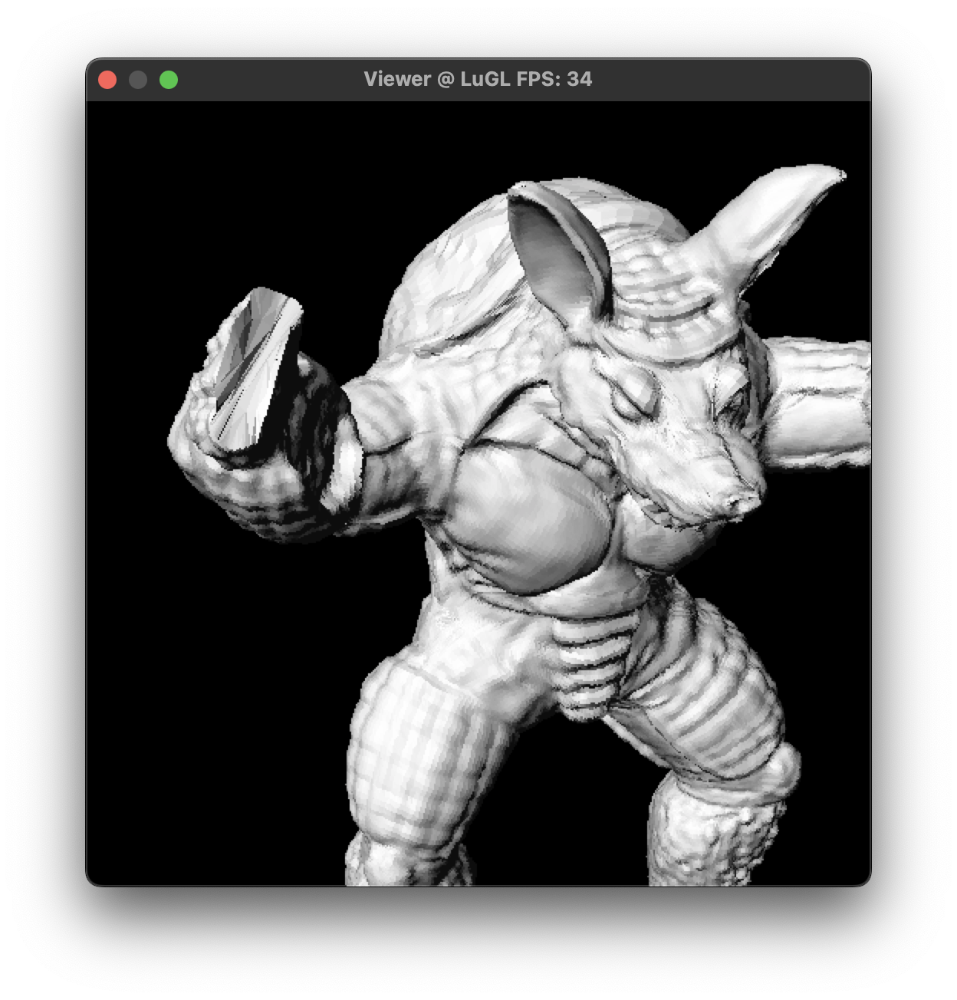
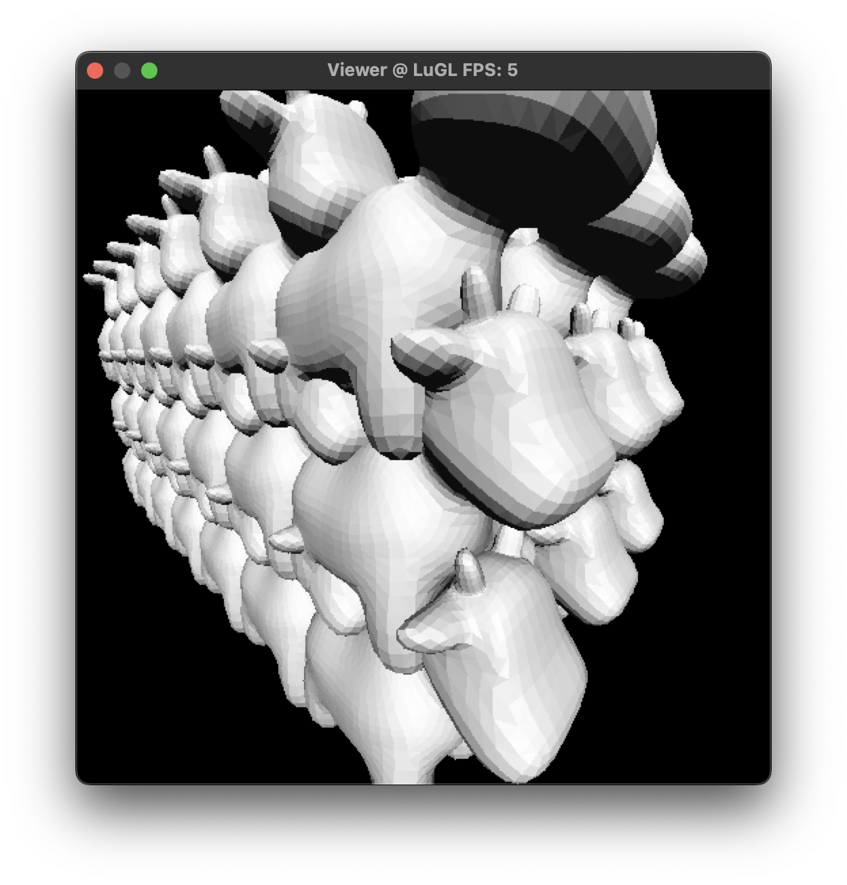

# Z-Buffer说明文档

## 概述

本项目为2022-2023秋冬学期《计算机图形学》课程大作业，实现了以下功能：

- 多边形扫描转换
- 扫描线Z-Buffer
- 普通Z-Buffer（全画幅Z-Buffer）
- 层次Z-Buffer
- 八叉树加速的层次Z-Buffer

**详细信息请看 [说明文档](./Document.md)**

| 程序运行截图 ||
|---|---|
| | |

## 编译项目

### 多边形扫描转换

多边形扫描转换的实现位于`polygon_scanline.cpp`文件中，通过如下指令编译并运行后结果将储存为文件名为`result.png`的图像。

MacOS：

```bash
g++ -std=c++17 -Og polygon_scanline.cpp -o out && ./out
```

Windows：

```bash
g++ -std=c++17 -Og polygon_scanline.cpp -o out && out.exe
```

### Z-Buffer

Z-Buffer相关算法在**窗口程序**中展示，提供`makefile`和`.sln`编译并运行，目前支持MacOS和Windows（Win32）平台。**本程序未使用多线程或者GPU加速**，编译使用的参数为`std=c++17 -O3`，如果需要贴调整编译参数可以查看并修改makefile文件或在Visual Studio的Project-Properties中修改：

**MacOS**

1. 在根目录下打开Terminal或者`cd 根目录`
2. `make`

**Windows**

使用Visual Studio编译：

1. 用Visual Studio打开`Z-Buffer.sln`，推荐使用Visual Studio 2019或以上版本
2. 使用Ctrl+B编译，或者菜单栏-Build-Build Z-Buffer
3. 编译结果将被拷贝到根目录下，文件名`viewer.exe`

使用MinGW编译：

1. 安装MinGW [https://sourceforge.net/projects/mingw/](https://sourceforge.net/projects/mingw/) 选择合适的版本安装，并将`mingw64/bin`添加到**环境变量**
2. 打开CMD，`cd 根目录`
3. `mingw32-make`

## 运行程序

编译后使用**命令行**选择需要加载的模型和绘制模式：

**MacOS**

示例：

```bash
./viewer -i meshes/spot.obj
./viewer -i meshes/spot.obj -c 3 3
./viewer -i meshes/spot.obj -c 3 3 -z octz
./viewer -i meshes/spot.obj -c 5 3 -z hiez -p o -m b 10
```

**Windows**

示例：

```bash
viewer.exe -i meshes/spot.obj
viewer.exe -i meshes/spot.obj -c 3 3
viewer.exe -i meshes/spot.obj -c 3 3 -z octz
viewer.exe -i meshes/spot.obj -c 5 3 -z hiez -p o -m b 10
```

### 启动参数

- `-i` 需要加载的模型（必填）
- `-z` 需要使用的Z-Buffer算法：
    - `simple` 简单Z-Buffer算法（默认）
    - `scanline` 扫描线Z-Buffer算法
    - `hiez` 层次Z-Buffer算法
    - `octz` 空间八叉树加速的Z-Buffer算法
- `-c` 绘制数量：
    - `1 n` 绘制1*1*n个模型（默认 1 1）
    - `3 n` 绘制3*3*n个模型
    - `5 n` 绘制5*5*n个模型
- `-m` 绘制模式：
    - `r` 实时模式（默认）
    - `b n` Benchmark模式，绘制n帧并输出计时结果
- `-p` 投影模式：
    - `p` 透视投影（默认）
    - `o` 正交投影

## 窗口操作指南

**鼠标拖拽**：旋转视角

**鼠标滚轮**：在透视投影下调整FOV

**空格键**：重置视角

**ESC键**：退出程序

## 性能

下图为Armadillo模型的绘制结果（1024x1024），模型共212574个三角形，在**Mac Book Pro 2019@1.4 GHz Quad-Core Intel Core i5**测试平台下，绘制用时45.1752ms

**命令行：**

查看实时绘制结果：`viewer.exe -i meshes/armadillo.obj`

查看绘制用时：`viewer.exe -i meshes/armadillo.obj -m b 1`

